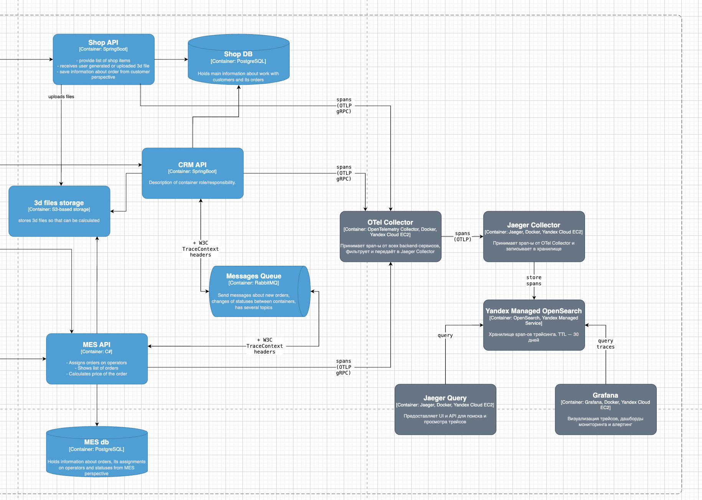
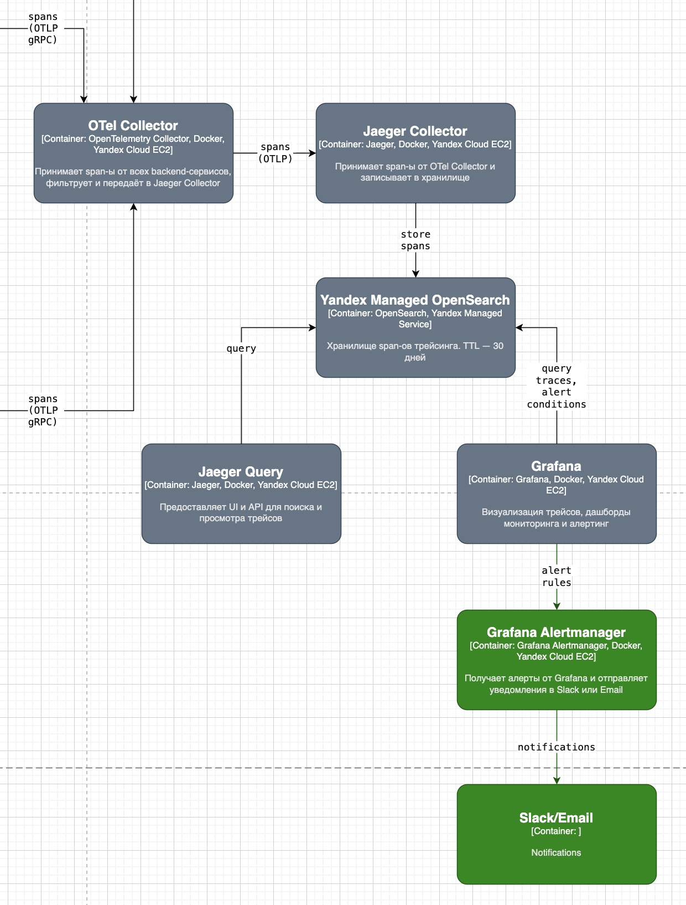

# Задание 3. Архитектурное решение по трейсингу

## 1. Анализ системы: где заказ может сломаться

### Точки риска на пути заказа

Заказ проходит через три системы (онлайн-магазин, MES, CRM) и один брокер сообщений (RabbitMQ). Ниже перечислены места, где заказ может зависнуть или потеряться.

| Место                                              | Статус До                | Статус После              | Риск                                                                                                                     |
|----------------------------------------------------|--------------------------|---------------------------|--------------------------------------------------------------------------------------------------------------------------|
| Онлайн-магазин -> MES (запрос расчета стоимости)   | `FILE_UPLOADED`          | `PRICE_CALCULATED`        | Запрос уходит, но ответ теряется или MES не отвечает (до 30 минут). Заказ навсегда остается в `SUBMITTED`.               |
| MES -> CRM через RabbitMQ (событие о расчете)      | `PRICE_CALCULATED`       | `MANUFACTURING_APPROVED`  | Сообщение теряется в очереди или не потребляется CRM. Заказ есть в MES, но отсутствует в CRM.                            |
| Внешний API -> MES -> CRM (B2B-заказы)             | —                        | `PRICE_CALCULATED`        | Дополнительная точка входа без трейсинга: непонятно, где именно застрял заказ партнера.                                  |
| CRM -> MES (подтверждение производства)            | `MANUFACTURING_APPROVED` | `MANUFACTURING_STARTED`   | Заказ подтвержден в CRM, но оператор MES его не видит или не берет в работу.                                             |
| MES дашборд (пагинация и фильтрация)               | `MANUFACTURING_STARTED`  | `MANUFACTURING_COMPLETED` | Новые заказы не отображаются оперативно — операторы их пропускают.                                                       |
| MES -> транспортная компания -> CRM                | `SHIPPED`                | `CLOSED`                  | Статус закрытия приходит от внешней системы. Задержка или потеря этого события — заказ формально никогда не закрывается. |

### Системы, которые необходимо покрыть трейсингом

- **Онлайн-магазин Shop API(Java Spring Boot backend)** — обязательно
- **MES API (C#)** — обязательно
- **CRM API (Java Spring Boot)** — обязательно
- **RabbitMQ** — обязательно (через propagation заголовков трейса в сообщениях)
- **Внешний API (публичный эндпоинт MES API)** — обязательно
- **Взаимодействие с транспортной компанией** — желательно (если есть webhook или polling)

Фронтенд (Vue, React) покрывать трейсингом **не требуется** в первую очередь: узкие места находятся на backend и в брокере.

## 2. Список данных для трейсинга

Каждый span должен содержать следующие атрибуты:

### Обязательные атрибуты

| Атрибут           | Описание                                                    |
|-------------------|-------------------------------------------------------------|
| `trace_id`        | Уникальный идентификатор всего пути заказа                  |
| `span_id`         | Идентификатор конкретной операции внутри трейса             | 
| `parent_span_id`  | Ссылка на родительскую операцию                             | 
| `order_id`        | Бизнес-идентификатор заказа                                 |
| `task_id`         | Идентификатор задания на расчет стоимости изделия по модели | 
| `order_status`    | Текущий статус заказа в момент операции                     | 
| `service_name`    | Имя сервиса, создавшего span                                |
| `operation_name`  | Название операции                                           |
| `timestamp_start` | Время начала операции (UTC, мс)                             |
| `duration_ms`     | Длительность операции в миллисекундах                       |
| `status`          | Результат: OK / ERROR                                       | 
| `error_message`   | Текст ошибки (если есть)                                    |

### Дополнительные атрибуты

| Атрибут                            | Описание                                                  |
|------------------------------------|-----------------------------------------------------------|
| `user_type`                        | Тип пользователя: `b2c`, `b2b_api`, `operator`, `manager` |
| `partner_id`                       | ID партнера для B2B-заказов                               |
| `queue_name`                       | Название очереди RabbitMQ                                 |
| `message_id`                       | ID сообщения в RabbitMQ                                   |
| `http_method` / `http_status_code` | Для HTTP-операций                                         |
| `model_complexity`                 | Сложность модели (simple/medium/complex)                  |
| `product_category`                 | Категория изделия (кольца, серьги и т.д.)                 |
| `environment`                      | `prod`, `release`, `dev`                                  |
| `instance_id`                      | ID EC2-инстанса (важно при масштабировании)               |

**Важно:** В трейсы не должны попадать персональные данные клиентов (ФИО, email, адрес доставки, платежные данные). Это нарушает требования безопасности и потенциально — законодательство (ФЗ-152 "О персональных данных").

## 3. Мотивация

### Почему нужен трейсинг

Сейчас компания не имеет инструментов для ответа на вопрос: "Что произошло с конкретным заказом и где он находится прямо сейчас?" Команда узнает о проблемах от клиентов или менеджеров по продажам с задержкой в дни или недели. Трейсинг позволит команде быстро и эффективно расследовать инциденты.

**Для бизнеса:**
- Снижение количества просроченных заказов -> удержание крупных B2B-партнеров (компания уже потеряла несколько контрактов).
- Прозрачность процессов для менеджеров и операторов без необходимости ручных проверок.
- Доказательная база при разборе споров с партнерами: "заказ завис на вашей стороне, а не у нас".

**Для команды:**
- Диагностика инцидентов за минуты вместо часов.
- Понимание, какой из трех сервисов является узким местом при росте нагрузки.
- Основа для автоматического алертинга и SLA-мониторинга.

### Метрики, на которые повлияет внедрение трейсинга

| Метрика                                                               | Тип         | Ожидаемый эффект                                                                                                  |
|-----------------------------------------------------------------------|-------------|-------------------------------------------------------------------------------------------------------------------| 
| Среднее время обнаружения инцидента (MTTD)                            | Техническая | Сокращение с дней до минут                                                                                        |
| Среднее время восстановления (MTTR)                                   | Техническая | Сокращение за счет быстрой локализации проблемы                                                                   |
| Процент заказов, застрявших в статусе (например, `SUBMITTED` > 1 час) | Бизнес      | Цель: снизить до менее 1% от общего потока                                                                        |
| Процент выполнения SLA (доля заказов, выполненных за 3 недели)        | Бизнес      | (Косвенное влияние) Трейсинг позволяет обнаружить зависший заказ до того, как срок истек, и среагировать вовремя. |
| Количество жалоб клиентов на просроченные заказы в месяц              | Бизнес      | (Косвенное влияние) Снижение через проактивное обнаружение и разрешение проблем                                   |

## 4. Предлагаемое решение

### Выбор технологического стека

**OpenTelemetry (OTel)** — основной инструмент для сбора. Выбран по следующим причинам:
- Вендор-нейтральный стандарт: поддерживает Java, C# (.NET) и JavaScript из коробки.
- Не требует переписывать код: большинство операций (HTTP, DB, очереди) покрываются трейсингом авто-агентом.
- Не привязывает код к конкретному хранилищу трейсов — можно менять хранилище без изменения кода.

**Jaeger** — бэкенд для хранения и визуализации трейсов. Развертывается в Yandex Cloud на отдельном EC2-инстансе в distributed-режиме (Jaeger Collector + Jaeger Query). Причины выбора:
- Зрелое open-source решение, широко используется в индустрии.
- Нативно принимает данные в формате OpenTelemetry (OTLP).
- Встроенный UI для поиска трейсов по `trace_id`, `order_id`, сервису, статусу ошибки.
- Горизонтально масштабируется при росте нагрузки.

**Yandex Managed Service for OpenSearch** — хранилище для span-ов Jaeger. Причины:
- Managed-сервис: не нужно самостоятельно управлять кластером.
- Jaeger поддерживает OpenSearch/Elasticsearch нативно.
- Гибкая настройка TTL через Index Lifecycle Management.

**OpenTelemetry Collector** — промежуточный агрегатор span-ов. Принимает данные от всех сервисов, фильтрует, батчит и отправляет в Jaeger Collector.

**Grafana** — визуализация и алертинг. Jaeger Query используется для поиска конкретного трейса по `order_id`. Grafana — для агрегированных дашбордов и алертинга: например, сколько заказов зависло за последний час или P95 времени расчета стоимости.

### Архитектура решения

### Что нужно сделать в каждом сервисе

**Shop API и CRM API (Java Spring Boot):**
- Подключить `opentelemetry-javaagent.jar` — запускается как Java-агент, без изменений в коде.
- Автоматически покрываются HTTP-запросы, JDBC, RabbitMQ consumer/producer.
- Добавить кастомные span-атрибуты: `order_id`, `order_status`, `user_type` — 5–10 строк кода в бизнес-логике.

**MES API (C#):**
- Подключить библиотеки OpenTelemetry для C#: `OpenTelemetry`, `OpenTelemetry.Instrumentation.AspNetCore`, `OpenTelemetry.Instrumentation.Http`, `OpenTelemetry.Instrumentation.RabbitMq`.
- Настроить сбор трейсов в MES API.
- MES куплен с исходным кодом — у команды есть доступ для внесения изменений. Это снимает ключевой блокер.
- Добавить кастомные атрибуты: `order_id`, `operator_id`, `model_polygon_count`.

**RabbitMQ:**
- Трейс-контекст передается через заголовки сообщений по стандарту **W3C TraceContext** (`traceparent`, `tracestate`).
- OTel SDK для Java и .NET делает это автоматически при использовании библиотек OpenTelemetry для RabbitMQ.

**Внешний API:**
- Добавить middleware для извлечения `traceparent` из входящего запроса партнера.
- Генерировать новый root trace, если партнер не передает контекст.

**OTel Collector:**
- Развернуть как отдельный Docker-контейнер на Yandex Cloud (или как sidecar).
- Настроить группировку span-ов перед отправкой. Начать с записи 100% трейсов, затем — выборочно, только те, где были ошибки или превышено время выполнения.

### Ссылка на диаграмму

[jewerly_c4_model_tracing.drawio](jewerly_c4_model_tracing.drawio) - страница Tracing

## 5. Компромиссы

### Где трейсинг не принесет пользы или будет ограничен

**1. MES — купленная система (частичный риск)** \
Хотя MES поставляется с исходным кодом, команда C# состоит из одного разработчика и тимлида. Внедрение OTel в MES потребует времени и аккуратного тестирования. Риск: введение регрессий в критическую производственную систему. \
*Как снизить риск:* начать с автоматических инструментов (минимум кода), кастомные span-атрибуты добавлять итеративно.

**2. Внешние системы (транспортная компания)** \
Взаимодействие с транспортной компанией, скорее всего, идет через сторонний API или webhook без поддержки W3C TraceContext. Трейс будет прерываться на этой границе. \
*Как снизить риск:* логировать `order_id` и `shipment_id` на входе/выходе, коррелировать вручную.

**3. Высокая нагрузка и стоимость хранения** \
При росте на 100 заказов в месяц объем span-ов будет расти. Хранение всех трейсов без TTL или семплирования приведет к росту расходов. \
*Как снизить риск:* установить TTL на 30 дней, перейти на tail-based sampling при достижении >1000 заказов/день.

**4. Трейсинг не заменяет мониторинг инфраструктуры** \
Трейсинг покажет, что заказ завис на `calculate-price` 28 минут, но не объяснит, почему MES-инстанс был перегружен (нужны метрики CPU/RAM). Трейсинг работает в паре с метриками, не вместо них.

**5. Исторические данные** \
Трейсинг работает только с момента внедрения. Исторические зависшие заказы (до внедрения) не будут отражены в трейсах — их нужно разбирать вручную или через прямые запросы к БД.

## 6. Безопасность

### Защита доступа к системе трейсинга

**Аутентификация и авторизация:**
- Grafana закрывается корпоративной аутентификацией (SSO через существующий IdP компании, либо Grafana built-in auth).
- Jaeger Query UI не имеет встроенной аутентификации — перед ним ставится reverse proxy (nginx) с SSO или basic auth.
- Роли доступа:
    - `Поддержка` — просмотр трейсов, поиск по `order_id`.
    - `Разработчик` — полный доступ, включая дашборды и конфигурацию.
    - `Менеджер/Тимлид` — просмотр бизнес-дашбордов (без raw span-ов).
- Jaeger Query и Yandex Managed OpenSearch доступны только внутри VPC (не открываются в интернет).

**Защита данных в трейсах:**
- Запрет на передачу персональных данных в атрибутах span-ов — закрепить в команде как архитектурное соглашение (ADR).
- OTel Collector настроить с AttributesProcessor для удаления/маскирования запрещенных полей (например, если разработчик случайно добавил `customer_email`).

**Защита OTel Collector:**
- Collector не открывается в публичный интернет; endpoint для приема span-ов доступен только из внутренней сети (Security Group в Yandex Cloud).
- TLS-шифрование между сервисами и Collector.

**Аудит:**
- Все действия в Grafana (просмотр трейсов, изменение дашбордов) логируются встроенными средствами Grafana Audit Log.

## 7. Дополнительное задание: автоматический мониторинг и алертинг

### Концепция

На основе данных трейсинга настраивается автоматический мониторинг процесса прохождения заказа. Grafana позволяет строить метрики прямо из трейсов через **TraceQL** и **Metrics Generator** (RED-метрики: Rate, Errors, Duration).

### Компоненты мониторинга

**Grafana Jaeger Data Source** — подключение Grafana к Jaeger Query для построения дашбордов и метрик из трейсов.

**Grafana Alertmanager** — движок алертинга, интегрированный с Grafana.

**Grafana Dashboard** — единый экран состояния всех заказов в реальном времени.

### Сценарии алертинга

| Алерт                    | Условие                               | Получатель         | Приоритет  |
|--------------------------|---------------------------------------|--------------------|------------|
| Ошибка в Shop API        | Процент ошибок превысил 5% за 5 минут | Команда разработки | HIGH       |
| Ошибка в MES API         | Процент ошибок превысил 5% за 5 минут | Команда разработки | HIGH       |
| Ошибка в CRM API         | Процент ошибок превысил 5% за 5 минут | Команда разработки | HIGH       |
| Медленный ответ Shop API | P95 времени ответа превысил N мс      | Команда разработки | HIGH       |
| Медленный ответ MES API  | P95 времени ответа превысил N мс      | Команда разработки | HIGH       |
| Медленный ответ CRM API  | P95 времени ответа превысил N мс      | Команда разработки | HIGH       |

### Каналы уведомлений

Grafana Alertmanager поддерживает: Email, Slack, Telegram. Рекомендуется начать со Slack (быстро, минимум настройки).

### Ссылка на диаграмму

[jewerly_c4_model_tracing.drawio](jewerly_c4_model_tracing.drawio) - страница +Alerting

## Задание 3.1. Трейсинг с OpenTelemetry и Jaeger