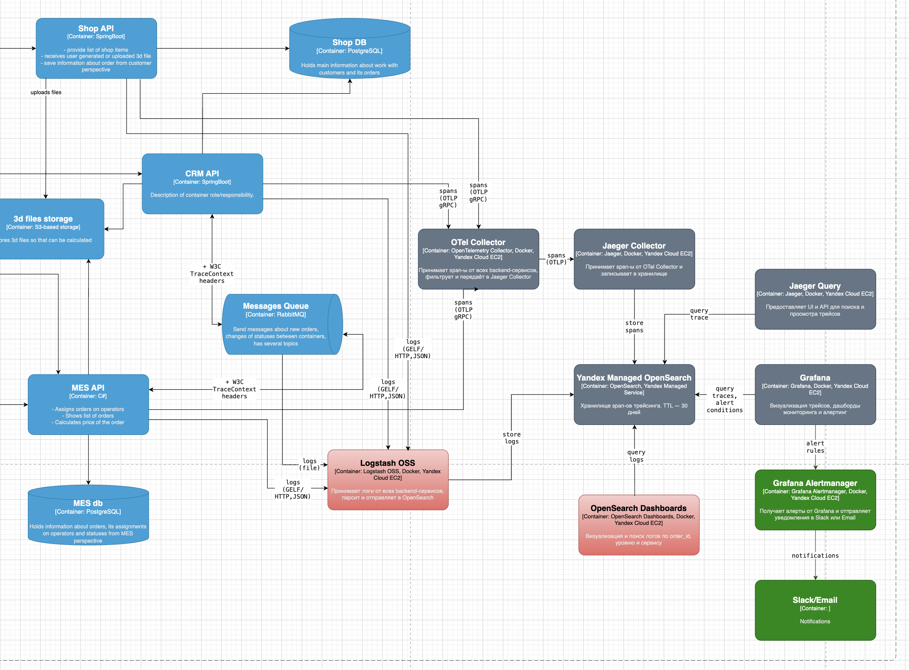

# Задание 4. Архитектурное решение по логированию

## 1. Анализ системы: какие логи собирать и откуда

### Системы, из которых необходимо собирать логи

- **Shop API (Java Spring Boot backend)** — обязательно
- **MES API (C#)** — обязательно
- **CRM API (Java Spring Boot)** — обязательно
- **RabbitMQ** — обязательно (логи публикации и потребления сообщений)
- **Внешний API (публичный эндпоинт MES)** — обязательно

Фронтенд (Vue, React) в первую очередь не покрываем — узкие места находятся на backend.

### Уровень INFO — штатные события

**Shop API:**

| Событие                                                        | Поля                                                                        |
|----------------------------------------------------------------|-----------------------------------------------------------------------------|
| Пользователь начал оформление заказа (положил товар в корзину) | `timestamp`, `order_id`, `user_id`                                          |
| Пользователь отправил 3D-модель на расчет стоимости            | `timestamp`, `order_id`, `user_id`, `model_complexity`, `product_category`  |
| Пользователь подтвердил заказ (нажал "Сделать заказ")          | `timestamp`, `order_id`, `user_id`                                          |

**MES API:**

 | Событие                         | Поля                                                                                  |
|---------------------------------|---------------------------------------------------------------------------------------|
| Заказ принят в расчет стоимости | `timestamp`, `order_id`, `model_complexity`, `product_category`                       |
| Стоимость рассчитана            | `timestamp`, `order_id`, `model_complexity`, `product_category`, длительность расчета |
| Оператор взял заказ в работу    | `timestamp`, `order_id`, `operator_id`                                                |
| Оператор завершил заказ         | `timestamp`, `order_id`, `operator_id`                                                |
| Заказ упакован и отправлен      | `timestamp`, `order_id`                                                               |

**CRM API:**

| Событие                   | Поля                                                                             |
|---------------------------|----------------------------------------------------------------------------------|
| Менеджер подтвердил заказ | `timestamp`, `order_id`, `manager_id`                                            |
| Заказ закрыт              | `timestamp`, `order_id`, причина закрытия (вручную или от транспортной компании) |

**RabbitMQ:**

| Событие                          | Поля                                                   |
|----------------------------------|--------------------------------------------------------|
| Сообщение опубликовано в очередь | `timestamp`, `order_id`, `events_id`, название очереди |
| Сообщение потреблено из очереди  | `timestamp`, `order_id`, `events_id`, название очереди |

### Уровень WARN — нестандартная ситуация, система продолжает работать

| Контейнер | Событие                                          | Поля                                                                                  |
|-----------|--------------------------------------------------|---------------------------------------------------------------------------------------|
| MES API   | Расчет стоимости занял больше 20 минут           | `timestamp`, `order_id`, `model_complexity`, `product_category`, длительность расчета |
| RabbitMQ  | Повторная попытка отправить сообщение в RabbitMQ | `timestamp`, `order_id`, `events_id`, название очереди, номер попытки                 |
| CRM API   | Заказ долго не берется оператором в работу       | `timestamp`, `order_id`                                                               |

### Уровень ERROR — ошибка, требует внимания

| Контейнер | Событие                                      | Поля                                                                 |
|-----------|----------------------------------------------|----------------------------------------------------------------------|
| RabbitMQ  | Не удалось опубликовать сообщение в RabbitMQ | `timestamp`, `order_id`, `events_id`, название очереди, текст ошибки |
| RabbitMQ  | Не удалось потребить сообщение из очереди    | `timestamp`, `order_id`, `events_id`, название очереди, текст ошибки |
| RabbitMQ  | Ошибка парсинга сообщения из очереди         | `timestamp`, `order_id`, `events_id`, название очереди, текст ошибки |
| MES API   | Ошибка при расчете стоимости в MES           | `timestamp`, `order_id`, текст ошибки                                |
| MES API   | Ошибка при вызове внешнего API партнера      | `timestamp`, `order_id`, `partner_id`, текст ошибки                  |

### Уровень FATAL — сервис не может продолжать работу

| Контейнер                   | Событие                                                          | Поля                                               |
|-----------------------------|------------------------------------------------------------------|----------------------------------------------------|
| Shop API, CRM API, MES API  | Сервис не запускается                                            | `timestamp`, `service`, текст ошибки, stack srace  |
| Shop API, CRM API, MES API  | Сервис не может подключиться к базе данных при старте            | `timestamp`, `service`, текст ошибки, stack srace  |
| CRM API, MES API            | Сервис потерял соединение с RabbitMQ и не может восстановить его | `timestamp`, `service`, текст ошибки, stack srace  |

## 2. Мотивация

### Почему нужно логирование

Сейчас команда узнает об ошибках от клиентов: разработчикам приходится разбирать проблему со слов пользователя, без возможности посмотреть что именно произошло на стороне сервиса. Это занимает много времени и не всегда приводит к результату. Централизованное логирование дает команде полную картину событий внутри каждого сервиса.

### Метрики, на которые повлияет внедрение логирования

| Метрика                                               | Тип         | Ожидаемый эффект                                                      |
|-------------------------------------------------------|-------------|-----------------------------------------------------------------------|
| Среднее время разбора инцидента                       | Техническая | Сокращение: разработчик видит детали ошибки сразу, без опроса клиента |
| Количество обращений в поддержку по одному инциденту  | Бизнес      | Снижение: команда находит причину быстрее и не переспрашивает клиента |
| Процент ERROR и FATAL логов от общего объема          | Техническая | Базовая метрика здоровья системы; цель — снижение со временем         |
| Количество потерянных сообщений в RabbitMQ            | Техническая | Сейчас неизвестно; после внедрения — цель 0%                          |
| Процент заказов с ошибками на этапе расчета стоимости | Бизнес      | Позволяет выявить паттерны: какие типы моделей вызывают ошибки        |

## 3. Приоритетность внедрения

Команда не может одновременно внедрить логирование во всех системах. Рекомендуемый порядок:

**1. MES API (C#) — первый приоритет**

Именно здесь происходит расчет стоимости — самый длительный и непрозрачный этап. Большинство жалоб клиентов связано с зависанием заказов на этом этапе. MES куплен с исходным кодом — команда может вносить изменения.

**2. RabbitMQ — первый приоритет**

Потеря сообщений между сервисами — одна из главных причин зависших заказов. Логи публикации и потребления сообщений позволят быстро выявить эту проблему.

**3. CRM API (Java Spring Boot) — второй приоритет**

Подтверждение заказов и их закрытие — критичные бизнес-события. Java Spring Boot имеет зрелые библиотеки логирования, внедрение будет быстрым.

**4. Shop API (Java Spring Boot) — второй приоритет**

Точка входа для B2C-клиентов. Аналогично CRM — Java Spring Boot, внедрение быстрое.

**5. Внешний API — третий приоритет**

Важен для B2B-партнеров, но внедряется после того, как основные системы уже покрыты.

## 4. Предлагаемое решение

### Технологический стек

**Logstash OSS** — централизованный сборщик и обработчик логов. Развертывается как отдельный сервис (в Kubernetes или на отдельной ВМ), принимает логи от сервисов по GELF (порт 12201) или HTTP, парсит и отправляет в OpenSearch.
- Централизованная конфигурация — не требует установки агентов на каждый EC2-инстанс
- Мощные фильтры для парсинга и обогащения логов (grok, json, mutate)
- Нативная поддержка OpenSearch через выходной плагин opensearch

**Yandex Managed OpenSearch** — хранилище логов. Используется как единое хранилище для логов и трейсов Jaeger (Задание 3). Логи хранятся в отдельных индексах от трейсов.

**OpenSearch Dashboards** — визуализация логов, поиск по `order_id`, фильтрация по уровню и сервису. Входит в стек OpenSearch, нативно работает с OpenSearch (аналог Kibana для Elasticsearch).

**Grafana** — алертинг на основе логов. Уже присутствует в стеке трейсинга.

### Что нужно сделать в каждом сервисе

Логи должны отправляться в Logstash OSS в формате JSON (или GELF). Для этого в каждом сервисе настраивается системный логгер с выводом на удаленный хост.

**Shop API и CRM API (Java Spring Boot):**
- Настроить логирование через Logback (стандартная библиотека для Spring Boot) в формате JSON.
- Формат вывода — JSON (например, с помощью `logstash-logback-encoder`).
- Добавить `order_id` и `user_id` в контекст логгера (MDC) — тогда он автоматически будет присутствовать во всех логах в рамках обработки одного запроса.

**MES API (C#):**
- Настроить логирование через Serilog в формате JSON.
- Добавить `order_id` и `user_id` в контекст через `LogContext.PushProperty`.

**RabbitMQ:**
- Включить стандартный плагин логирования RabbitMQ.
- Настроить вывод логов в файл (например, `/var/log/rabbitmq/`).
- Logstash считывает этот файл с помощью `input file`.

**Logstash OSS:**
- Развернуть как отдельный сервис.
- Сервисы отправляют логи в Logstash OSS по протоколу GELF (порт 12201) или HTTP.
- Logstash OSS парсит, обогащает и отправляет логи в OpenSearch по HTTPS.

### Ссылка на диаграмму

[jewerly_c4_model_logging.drawio](jewerly_c4_model_logging.drawio) - страница Logging

## 5. Политика безопасности

**Доступ к логам:**
- OpenSearch Dashboards закрывается корпоративной аутентификацией (SSO).
- Роли доступа:
    - `Поддержка` — поиск логов по `order_id` и `user_id`, просмотр ERROR и FATAL.
    - `Разработчик` — полный доступ ко всем логам и индексам.
    - `Менеджер/Тимлид` — только агрегированные дашборды.
- Yandex Managed OpenSearch доступен **только внутри VPC**.

**Работа с чувствительными данными:**
- В логи **не попадают** персональные данные клиентов: ФИО, email, адрес доставки, платежные данные.
- Это закрепляется как архитектурное соглашение в команде.
- В Logstash OSS настраиваются фильтры (например, mutate с заменой или grok) для маскирования запрещенных полей на случай, если разработчик случайно добавил ПД в лог.

## 6. Политика хранения

**Структура индексов:**

| Индекс            | Содержимое    | TTL     |
|-------------------|---------------|---------|
| `logs-shop-api-*` | Логи Shop API | 30 дней |
| `logs-mes-api-*`  | Логи MES API  | 30 дней |
| `logs-crm-api-*`  | Логи CRM API  | 30 дней |
| `logs-rabbitmq-*` | Логи RabbitMQ | 30 дней |

Отдельный индекс на каждую систему позволяет:
- Настраивать разные права доступа на уровне индекса.
- Удалять логи одной системы без затрагивания остальных.
- Легче оценивать объем хранилища по каждому сервису.

**Ротация:** индексы создаются ежедневно (`logs-mes-2024-11-01`). По истечении TTL удаляются автоматически через Index State Management (ISM) в OpenSearch.

**Оценка объема:** при среднем размере одного лог-события ~500 байт и 1000 заказах в месяц с ~50 событиями на заказ — около 25 МБ в месяц на все системы. Объем управляемый даже при двукратном росте нагрузки.

## 7. Алертинг и анализ аномалий

### Алертинг через Grafana

| Алерт                    | Условие                                                         | Получатель                   | Приоритет  |
|--------------------------|-----------------------------------------------------------------|------------------------------|------------|
| Рост ERROR-логов         | Количество ERROR-событий превысило N за 5 минут                 | Команда разработки           | HIGH       |
| FATAL в любом сервисе    | Появился хотя бы один FATAL-лог                                 | Команда разработки + DevOps  | CRITICAL   |
| Ошибки расчета стоимости | Количество ERROR в MES при расчете превысило N за 10 минут      | Команда разработки           | HIGH       |
| Ошибки внешнего API      | Количество ERROR при вызове API партнера превысило N за 5 минут | Менеджер продаж + разработка | HIGH       |

### Анализ аномалий

OpenSearch поддерживает встроенные модули Anomaly Detection (AD) и Alerting — он автоматически выявляет отклонения от нормального поведения без ручной настройки порогов.

Примеры аномалий, которые стоит отслеживать:
- **Резкий рост количества заказов** — например, с 4 до 10 000 за секунду. Возможная причина: DDoS-атака или некорректный B2B-клиент, отправляющий запросы в цикле.
- **Резкое увеличение доли WARN-логов** по расчету стоимости — возможно, партнеры начали загружать аномально сложные модели.
- **Исчезновение INFO-логов из MES** — сервис перестал обрабатывать заказы, хотя они продолжают поступать.

## 8. Дополнительное задание: выбор технологии

| Критерий                                                               | OpenSearch (выбран)                                                                                         | ELK (Elasticsearch)                                                                      | Splunk                                                                | Loki (Grafana)                                                                                       |
|------------------------------------------------------------------------|-------------------------------------------------------------------------------------------------------------|------------------------------------------------------------------------------------------|-----------------------------------------------------------------------|------------------------------------------------------------------------------------------------------|
| Лицензия и стоимость владения                                          | Apache 2.0 — полностью открытая, без ограничений. Бесплатно для любых целей.                                | Elastic License / SSPL — ограничения для облачных сервисов. Продвинутые функции платные. | Проприетарная — платная, стоимость зависит от объема данных (дорого). | AGPL v3 — открытая, но с требованиями к распространению кода. Бесплатно                              |
| Производительность и масштабируемость                                  | Высокая (форк Elasticsearch 7.10). Горизонтальное масштабирование, горячие/холодные узлы.                   | Высокая. Проверена на петабайтах.                                                        | Высокая, но требует дорогого железа.                                  | Высокая для логов, но не поддерживает полнотекстовый поиск как OpenSearch.                           |
| Функциональность (поиск, визуализация, аналитика)                      | Полнотекстовый поиск, агрегации, Anomaly Detection, Alerting. Dashboards — форк Kibana.                     | Аналогично OpenSearch, плюс Machine Learning (платно).                                   | Очень мощная аналитика (SPL), SIEM, но сложная.                       | Ограниченный поиск (только по меткам и контексту), нет встроенной визуализации (использует Grafana). |
| Простота внедрения и поддержки                                         | Есть Managed Service в Yandex Cloud. Документация хорошая, но сообщество меньше, чем у ELK.                 | Огромное сообщество, масса статей. Сложность настройки высокая.                          | Сложная настройка, требуется сертификация.                            | Простая установка, но интеграция с Logstass/Grafana может быть нетривиальной.                        |
| Совместимость с существующим стеком (Jaeger, Logstash, OpenTelemetry)  | Нативный плагин Trace Analytics для Jaeger. Logstash OSS имеет выход в OpenSearch. OpenTelemetry exporter.  | Jaeger поддерживает Elasticsearch. Logstash и Beats работают нативно. OpenTelemetry.     | Нет прямой интеграции с Jaeger (только через сторонние мосты).        | Jaeger не поддерживает Loki (только через метрики).                                                  |

### Обоснование выбора OpenSearch
Для компании Александрит выбрана OpenSearch по следующим причинам:
- Открытая лицензия Apache 2.0 — исключает риски, связанные с изменением лицензионной политики (как это произошло с Elasticsearch). Можно использовать в любых сценариях, включая облачные сервисы, без отчислений.
- Совместимость с Jaeger — плагин Trace Analytics позволяет хранить трейсы из Jaeger в тех же индексах, что и логи, и анализировать их в едином интерфейсе OpenSearch Dashboards. Это снижает сложность и стоимость поддержки.
- Наличие управляемого сервиса в Yandex Cloud — компания уже использует Yandex Cloud, и Managed Service for OpenSearch избавляет от операционной нагрузки (бэкапы, обновления, масштабирование).
- Полная функциональность — полнотекстовый поиск, агрегации, алертинг и Anomaly Detection для выявления DDoS-атак или аномальных всплесков заказов.
- Плавная миграция — OpenSearch — форк Elasticsearch 7.10, поэтому команда может использовать существующие навыки работы с Kibana/Elasticsearch (синтаксис запросов, дашборды), а также инструменты вроде Logstash OSS.

### Минусы, которые приняты
- Сообщество OpenSearch меньше, чем у ELK, но оно активно растет.
- Filebeat совместим только до версии 7.12.x, поэтому пришлось заменить его на Logstash OSS (что даже добавило гибкости).
- Некоторые плагины из экосистемы Elastic могут отсутствовать, но для задач компании их достаточно.

**Итог:** OpenSearch — наиболее сбалансированное решение, сочетающее открытость, производительность, совместимость с Jaeger и доступность в облаке.