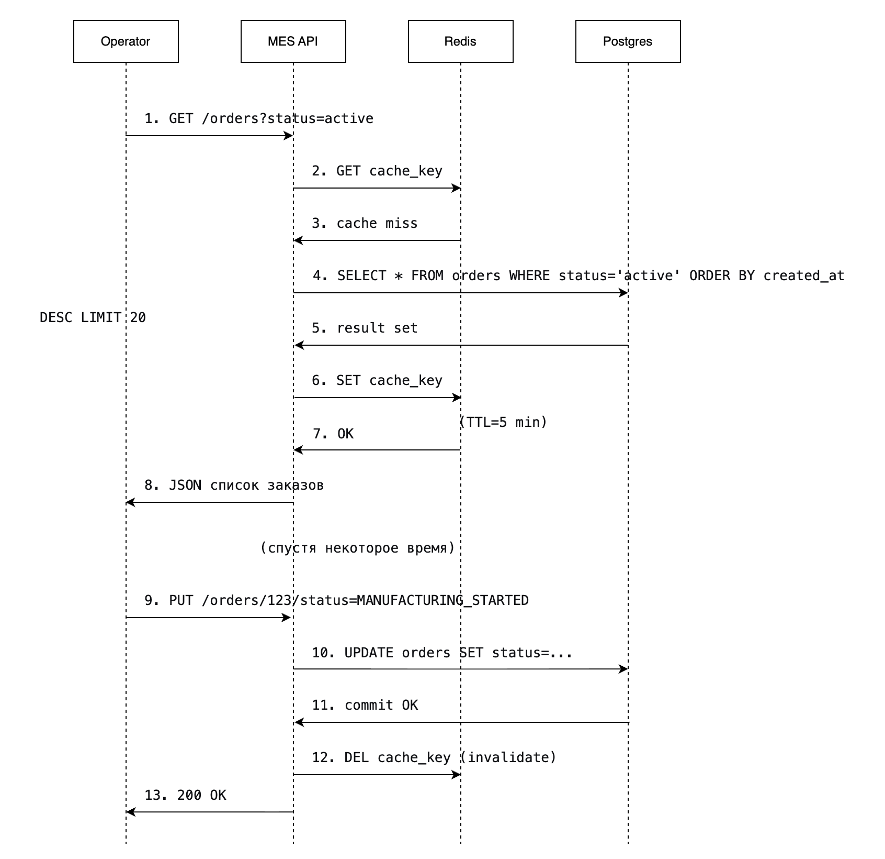

# Задание 5. Архитектурное решение по кешированию

## 1. Анализ системы

На основе C4-диаграммы и описания бизнес-сценариев компании Александрит определены следующие компоненты, которые испытывают высокую нагрузку и являются кандидатами на кеширование:

| Компонент                            | Проблема                                                                                                                                                           | Почему нужно кешировать                                                                                                                                                                                         |
|--------------------------------------|--------------------------------------------------------------------------------------------------------------------------------------------------------------------|-----------------------------------------------------------------------------------------------------------------------------------------------------------------------------------------------------------------|
| MES API (бэкенд) + дашборд оператора | Страница со списком заказов по статусам загружается долго, даже с фильтрацией и пагинацией. Рост числа заказов (+100 в месяц и API-партнеры) усугубляет ситуацию.  | Это самый частый и тяжелый запрос: фильтрация, сортировка, подсчет количества заказов в каждом статусе. Кеширование результата на несколько секунд резко снизит нагрузку на БД и ускорит отклик для операторов. |
| Shop API (онлайн-магазин)            | Справочные данные (типы изделий, категории, цены на типовые украшения) запрашиваются при каждом открытии каталога, но меняются редко (администратор раз в неделю). | Полное кеширование справочников устранит лишние обращения к БД и ускорит загрузку страниц для покупателей.                                                                                                      |
| CRM API                              | Аналогично MES, менеджеры просматривают списки заказов (например, ожидающих подтверждения). Хотя жалоб от CRM нет, рост нагрузки затронет и ее.                    | Кеширование списков заказов с учетом прав менеджера (по ключу `manager_id`) снизит количество одинаковых SQL-запросов.                                                                                          |

Приоритет кеширования (от самого важного):
1. MES дашборд — критичен для операторов и напрямую влияет на скорость выполнения заказов.
2. Справочники Shop API — просты в реализации, дают быстрый эффект.
3. CRM списки заказов — может быть реализовано позднее, но с использованием той же инфраструктуры.

## 2. Мотивация

### Почему нужно кэширование

В текущей архитектуре каждый запрос к дашборду MES (список заказов по статусам) и к справочным данным онлайн-магазина (категории, типы изделий) выполняется напрямую к базе данных. При росте числа заказов (+100 в месяц + подключение API-партнеров) нагрузка на PostgreSQL увеличивается, запросы становятся долгими даже с фильтрацией и пагинацией. Операторы жалуются на тормоза, а клиенты получают заказы позже — потому что операторы не видят вовремя новые заказы.

Кэширование позволит:
- Сохранять результаты частых и тяжелых запросов в быстрой оперативной памяти (Redis).
- Отдавать данные из кэша за миллисекунды вместо секунд.
- Снизить количество одновременных подключений к БД и ее CPU-нагрузку.
- Обеспечить стабильную работу системы даже при резких пиках (утренний вход операторов).

### Метрики, на которые повлияет внедрение кэширования

| Метрика                                             | Тип         | Ожидаемый эффект                                                       |
|-----------------------------------------------------|-------------|------------------------------------------------------------------------|
| Время загрузки дашборда MES (p95)                   | Техническая | Уменьшение с 3–5 секунд до < 100 мс                                    |
| Количество SQL-запросов к БД на чтение (дашборд)    | Техническая | Снижение на 80–90%                                                     |
| Пропускная способность дашборда (RPS)               | Техническая | Рост в 3–5 раз без дополнительных ресурсов                             |
| Среднее время от создания заказа до взятия в работу | Бизнес      | Сокращение за счет того, что операторы видят новые заказы без задержки |
| Количество жалоб операторов на медленную работу     | Бизнес      | Стремление к нулю                                                      |

## 3. Предлагаемое решение

### Тип кеширования
Серверное кеширование с использованием Redis. Клиентское кеширование не подходит, потому что:
- Дашборд используется разными операторами на разных компьютерах — кеш клиента не разделяется.
- Данные могут меняться (статусы заказов) и клиентский кеш быстро устаревает.
- Нельзя управлять инвалидацией из центра.

### Паттерн кеширования
**Cache-Aside (Lazy Loading).**

Как работает:
- При запросе списка заказов приложение сначала проверяет Redis.
- Если данные есть (кеш hit) — возвращает их.
- Если данных нет (кеш miss) — читает из БД, сохраняет в Redis, возвращает.
- При изменении данных (например, оператор взял заказ в работу) — кеш инвалидируется (удаляется запись).

**Почему Cache-Aside, а не другие паттерны?**

| Паттерн        | Почему не подходит                                                                                                                                                                                                                                                        |
|----------------|---------------------------------------------------------------------------------------------------------------------------------------------------------------------------------------------------------------------------------------------------------------------------|
| Write-Through  | При каждом обновлении статуса заказа (`MANUFACTURING_STARTED`, `COMPLETED` и т.д.) нужно синхронно обновлять кеш. Это замедлит запись, а записи происходят часто. Операторам важнее скорость чтения (дашборд), чем записи (изменение статуса занимает 1-2 секунды и так). |
| Write-Back     | Слишком сложен для реализации, данные могут потеряться при сбое. Требует дополнительных механизмов синхронизации с БД.                                                                                                                                                    |
| Refresh-Ahead  | Требует предсказания, какие данные понадобятся в ближайшее время. Для дашборда это возможно (самые новые заказы), но не критично. Cache-Aside проще и надежнее.                                                                                                           |

Почему Cache-Aside лучше всего для этого случая:                                                                                                                                                                                                                              
- Чтение в 100 раз чаще записи (операторы смотрят дашборд каждые 10 секунд, а статус заказа меняется раз в несколько минут).
- Данные не требуют абсолютной свежести — допустимо, если оператор увидит новый заказ на 1-2 секунды позже (задержка при инвалидации).
- Реализация простая: проверка -> чтение -> сохранение -> инвалидация по ключу при обновлении.

### Диаграмма последовательности

Ниже представлена диаграмма для двух сценариев: чтение списка заказов (основной) и запись изменения статуса (инвалидация кеша).

[cached_orders_sequance_diagram.drawio](cached_orders_sequance_diagram.drawio)

### Стратегия инвалидации кеша
**Комбинированная стратегия:** временная инвалидация (TTL) + программная инвалидация по ключу.

#### 1. Временная инвалидация (TTL)
Устанавливается для каждой записи кеша (например, 5 минут для списка заказов, 1 час для справочников).

Если данные не изменились, они автоматически удаляются из кеша через TTL, и следующий запрос возьмет свежие данные из БД.

**Почему TTL важен:** Это "страховка" на случай, если программная инвалидация по какой-то причине не сработала (баг, потеря сообщения). Данные все равно обновятся максимум через 5 минут.

#### 2. Программная инвалидация по ключу (при изменении статуса)
При каждом изменении статуса заказа мы удаляем все кеш-ключи, связанные с заказами: `orders:status:*` — все страницы и фильтры.

#### Как это реализовать:
- При обновлении статуса вызывается метод `invalidateOrdersCache(old_status, new_status, order_id)`.
- Redis операция DEL по шаблону ключа (например, `orders:status:*`).
- Для этого Redis поддерживает команду KEYS или SCAN, но в production лучше хранить отдельный индекс (например, список ключей, связанных с заказом, в Set).

**Почему программная инвалидация необходима:** Без нее после смены статуса заказ мог бы оставаться в кеше в старом статусе до 5 минут (TTL). Оператор, открыв дашборд, увидел бы заказ, который уже взял другой оператор — это привело бы к конфликтам и неправильному распределению работы.

#### Почему другие стратегии не подходят?

| Стратегия                                   | Почему не подходит                                                                                                                                                                                                                 |
|---------------------------------------------|------------------------------------------------------------------------------------------------------------------------------------------------------------------------------------------------------------------------------------|
| Только временная (TTL)                      | Данные устаревают до 5 минут. Это неприемлемо для статусов заказов — операторы должны видеть актуальное состояние.                                                                                                                 |
| Только программная (без TTL)                | Если оператор изменил статус, а кеш по ошибке не инвалидировался (баг, сбой сети), данные останутся устаревшими навсегда. TTL дает fallback.                                                                                       |
| Инвалидация по событию (RabbitMQ)           | Можно, но усложняет архитектуру. При изменении статуса отправлять сообщение в очередь, а специальный слушатель будет чистить кеш. Это надежно, но для первого этапа достаточно прямого вызова.                                     |
| Write-Through (обновление кеша при записи)  | При изменении статуса нужно не только удалить старый ключ, но и записать новый обновленный список заказов. Это требует повторного запроса к БД, что замедлит запись. Проще удалить и позволить следующему чтению пересоздать кеш.  |

#### Итоговая стратегия для MES дашборда:
- При чтении: Cache-Aside с TTL 5 минут.
- При записи (изменение статуса): программная инвалидация (удаление кеш-ключей по префиксу).

Для справочников (типы изделий, категории): только TTL 1 час (они меняются редко).

## Дополнительное задание. Сравнение двух решений

Хотя основное решение выбрано (Cache-Aside + Redis), можно рассмотреть альтернативу: материализованное представление (read model) в отдельной таблице БД. Это тоже форма кеширования, но на уровне базы данных.

### Решение 1: Redis (Cache-Aside)

#### Описание

Кеш в памяти (Redis). Список заказов хранится в Redis с TTL 5 минут. При изменении данных — инвалидация.

#### Плюсы

- Очень быстро (чтение из памяти — микросекунды).
- Легко масштабировать (Redis Cluster).
- Уменьшает нагрузку на БД.
- TTL дает автоматическое "самоочищение".

#### Минусы

- Нужно поддерживать Redis (дополнительный компонент).
- При падении Redis кеш пуст, нагрузка на БД временно растет.
- Программная инвалидация требует аккуратности.

### Решение 2: Материализованное представление в PostgreSQL

#### Описание

Создается отдельная таблица `orders_dashboard_cache`, которая обновляется триггерами или по расписанию. Дашборд читает из нее.

#### Плюсы

- Не требует введения новой технологии (PostgreSQL уже есть).
- Более простая инвалидация (триггеры БД).
- Данные всегда консистентны (если обновление через триггер).

#### Минусы

- Запрос к материализованному представлению все равно идет в БД (медленнее, чем Redis).
- Обновление материализованного представления может тормозить запись (триггеры).
- Неудобно для пагинации и фильтрации (нужно пересчитывать всю таблицу при изменении статуса).
- Требует пересоздания индексов.

### Какое решение выбираем и почему?
Выбираем Решение 1 (Redis + Cache-Aside).

#### Обоснование:
- Скорость чтения — критична для дашборда, который операторы открывают каждые 10 секунд. Redis дает латентность < 1 мс, PostgreSQL даже с индексом — 10–50 мс.
- Масштабируемость — при росте нагрузки Redis легко масштабируется (кластер из нескольких узлов). PostgreSQL масштабировать сложнее (реплики, шардирование).
- Разгрузка БД — основная проблема MES в том, что БД не справляется с запросами. Перенос части нагрузки на Redis снизит количество соединений и блокировок.
- Гибкость инвалидации — TTL + программное удаление проще реализовать, чем триггеры на несколько таблиц (заказы, статусы, операторы). При изменении статуса заказа мы знаем, какой префикс ключей удалять.

#### Когда могло бы подойти Решение 2?
Если бы у команды не было опыта работы с Redis, а нагрузка на БД была невысокой. В нашем случае БД уже страдает, и время на внедрение Redis оправдано.